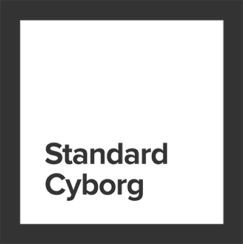

# regl-inertia-camera

> A 3D spherical coordinate camera for regl, for desktop and mobile

## Introduction

A 3D spherical coordinate camera with rotation, panning, zooming, and pivoting (i.e. yaw and pitch). Designed to function on desktop and mobile.

## Example

```javascript
const camera = require('regl-inertia-camera')(regl, {
  phi: 0.5,
  theta: 1,
  distance: 20,
});

camera(() => {
  reglDrawCmd();
});
```

See [demo.js][./demo.js] for fully worked example.

## Usage

### `camera = require('regl-inertia-camera')(regl[, opts])`

Given existing `regl` instance and options, returns a camera instance which sets camera projection and view matrix context and uniforms. For convenience, `view`, `projection` and `eye` are exposed through regl context variables as well as uniforms. Configuration options are:

| Option | Type | Default | Meaning |
| ------ | ----- | ------ | ------- |
| `element` | HTML element | `window` | element to which to attach |
| `viewUniformName` | String | `view` | name of view matrix uniform |
| `projectionUniformName` | String | `projection` | name of projection matrix uniform |
| `eyeUniformName` | String | `eye` | name of eye vector uniform |


The camera may be invoked as:

### camera([state, ] callback)

where `state` is an object containing changes to the camera state variables, defined below, and `callback` is a function invoked within the regl context of the camera. Callback receives `camera.state` as its parameter.

The returned camera contains the following _computed_ properties which will be overwritten on every draw frame and so _cannot_ (meaningfully) be modified:

| Camera variable | Type | Meaning |
| -------------- | ---- | ------- |
| `aspectRatio` | Number | current aspect ratio |
| `eye` | vec3 | location of camera |
| `height` | Number | current height of view |
| `projection` | mat4 | projection matrix |
| `projectionInv` | mat4 | inverse projection matrix |
| `view` | mat4 | view matrix |
| `viewInv` | mat4 | inverese view matrix |
| `width` | Number | current width of view |

The returned camera contains a `.state` property which contains the following state values, all of which may be written directly. On each invocation of `draw` these parameters will be checked for differences and will trigger a dirty camera where applicable so that the view is redrawn automatically.

| State variable | Type | Default/Initial | Meaning |
| -------------- | ---- | ------- | ------- |
| `center` | vec3 | `[0, 0, 0]` | point at the center of the view |
| `distance` | Number | `10` |  distance of eye from center |
| `dirty` | Boolean | `true` | true when camera view has changed |
| `dPhi` | Number | `0` | current phi inertia of camera |
| `dTheta` | Number | `0` | current theta inertia of camera |
| `enablePan` | Boolean | `true` | allow panning |
| `enablePivot` | Boolean | `true` | allow pivoting (yaw and pitch) of view |
| `enableRotation` | Boolean | `true` | allow rotation view |
| `enableZoom` | Boolean | `true` | allow zooming of view |
| `far` | Number | `100` | far clipping plane |
| `fovY` | Number | `π / 4` | field of view in the vertical direction, in radians |
| `near` | Number | `0.1` | near clipping plane |
| `panDecayTime` | Number | `100` | half life of panning inertia in ms |
| `panX` | Number | `0` | current horizontal amount to pan at next draw |
| `panY` | Number | `0` | current vertical amount to pan at next draw |
| `panZ` | Number | `0` | current in/out of plane amount to pan at next draw |
| `phi` | Number | `0` | azimuthal angle of camera |
| `pitch` | Number | `0` | current amount to pitch at next draw, in radians |
| `rotationCenter` | vec3 | `[0, 0, 0]` | point about which the view rotates
| `rotationSpeed` | Number | `1.0` | Speed of rotation interaction |
| `rotationDecayTime` | Number | `100` | half life of rotation inertia in ms |
| `rotateAboutCenter` | Boolean | `false` | If false, rotate about `rotationCenter`, otherwise rotates about the current view center. |
| `theta` | Number | `0` | horizontal rotation of camera |
| `up` | vec3 | `[0, 1, 0]` | vertical direction |
| `wheelSpeed` | Number | `1.0` | Speed of mouse wheel interaction |
| `x0` | Number | `null` | current horizontal location of interaction, in pixels |
| `y0` | Number | `null` | current vertical location of interaction, in pixels |
| `yaw` | Number | `0` | current amount to yaw at next draw, in radians |
| `zoom` | Number | `0` | current amount to zoom at next draw (0 = no change) |
| `zoomDecayTime` | Number | `100` | half life of zooming inertia in ms |

Finally, the returned camera contains the following methods:

| Method | Meaning |
| -------| ------- |
| .taint() | Mark the view "dirty" to trigger drawing on the next frame. |
| .resize() | Recompute the viewport size and aspect ratio and mark the view dirty |

## See also

- [regl-camera](https://github.com/regl-project/regl-camera)

## Credits

This module is heavily based on the work of [mikolalysenko](https://github.com/mikolalysenko) and [mattdesl](https://github.com/mattdesl).
Development supported by [Standard Cyborg](https://standardcyborg.com).



## License

&copy; 2018 Ricky Reusser. MIT License.
